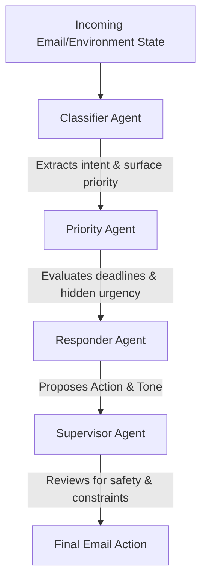
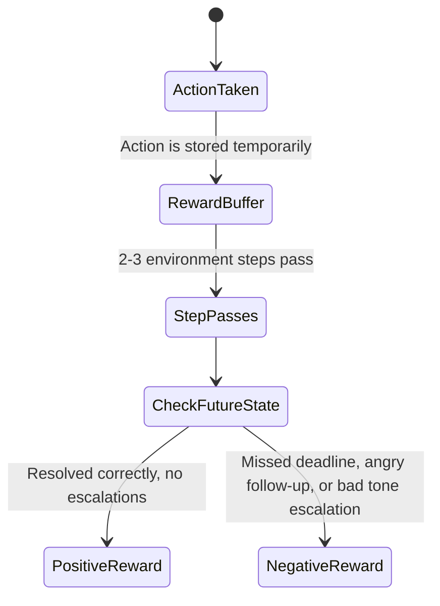

# InboxWorld Architecture

This document outlines the high-level architecture of the `InboxWorld` multi-agent email triage system and the environment's delayed reward mechanism.

## Multi-Agent Decision Pipeline

The core policy replaces a single monolithic LLM call with a role-based multi-agent architecture. This flow ensures safe and calculated handling of ambiguous or high-priority emails.

## Environment Delayed Reward System

To simulate real-world consequences, `InboxWorld` uses a buffered reward mechanism instead of shallow, immediate textual grading. Actions have ripple effects.

